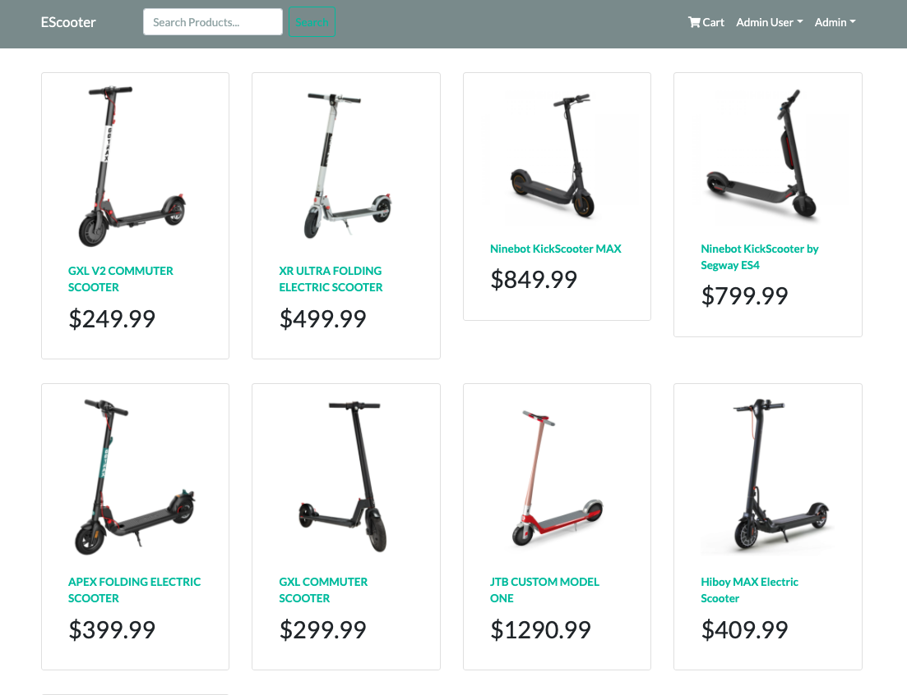
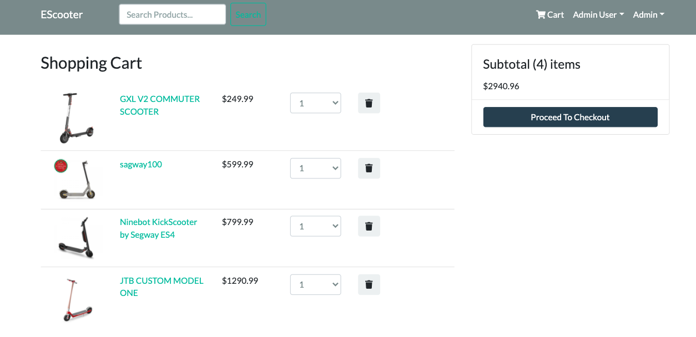
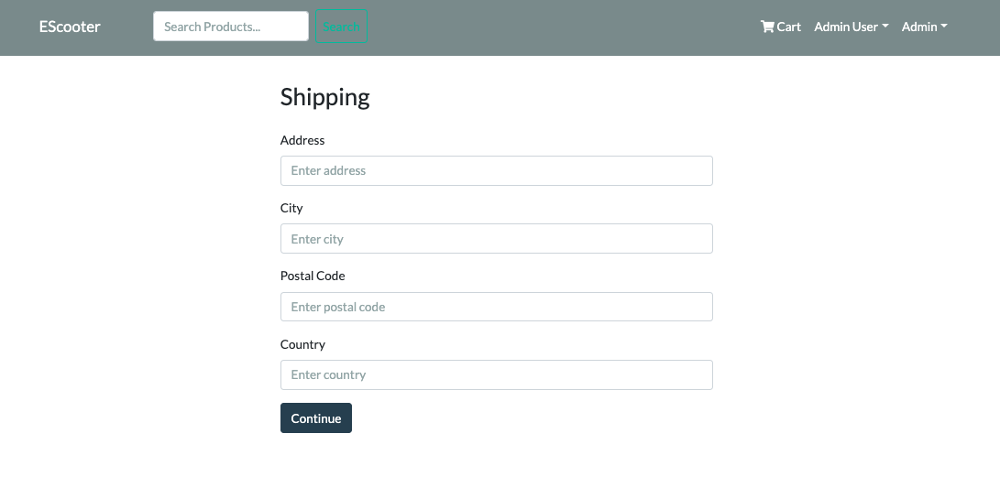
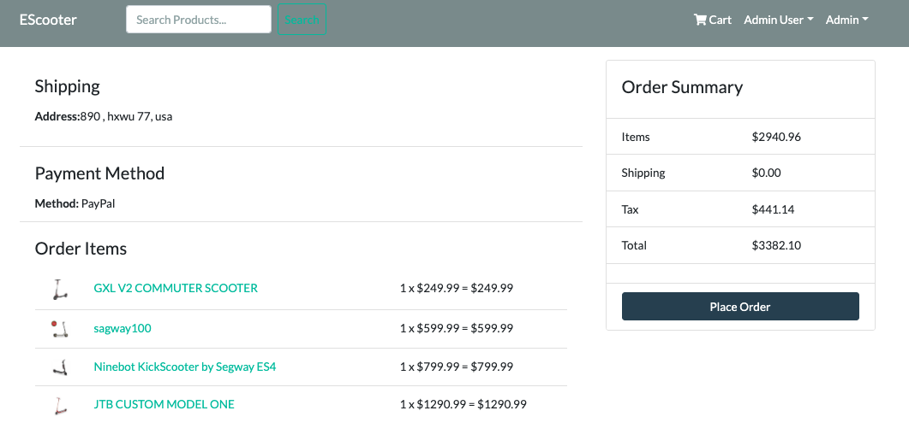
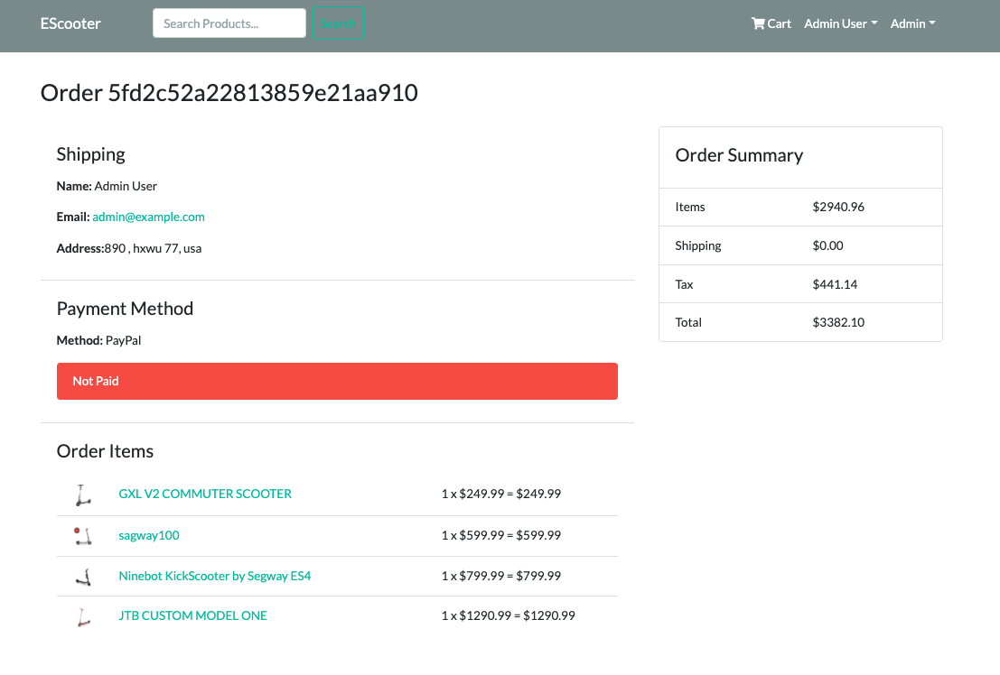
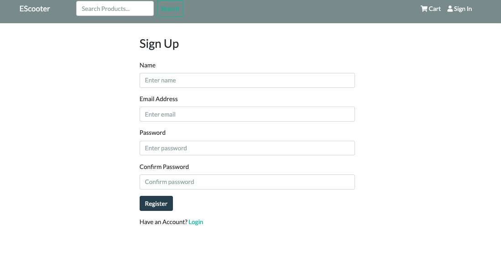
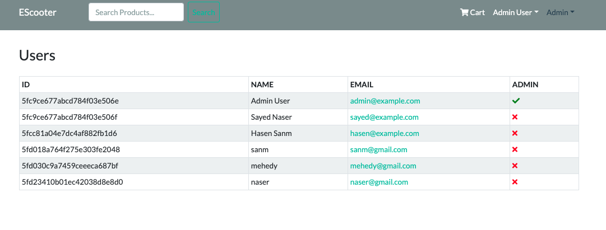
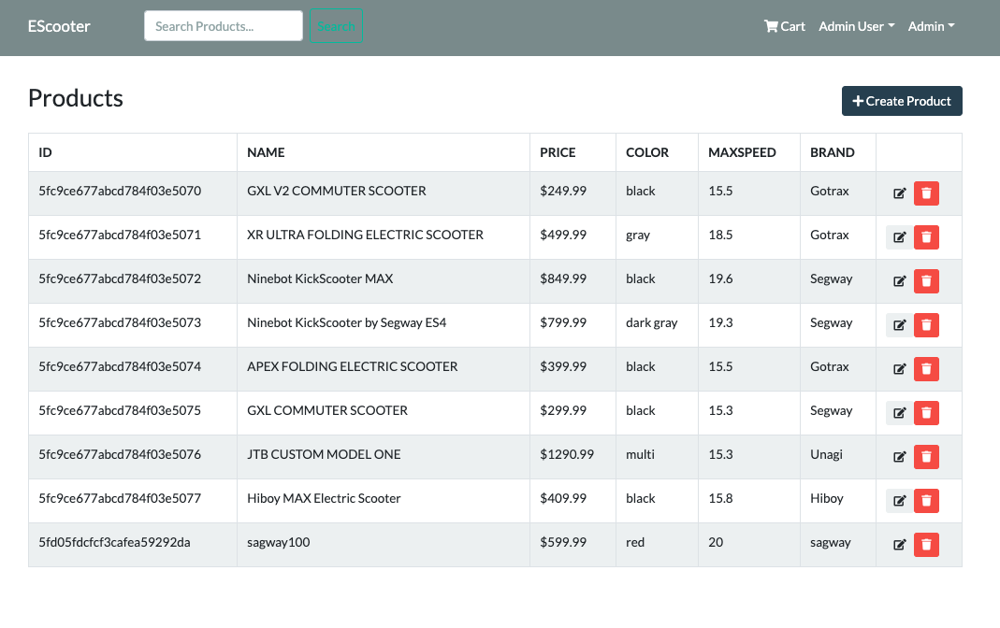
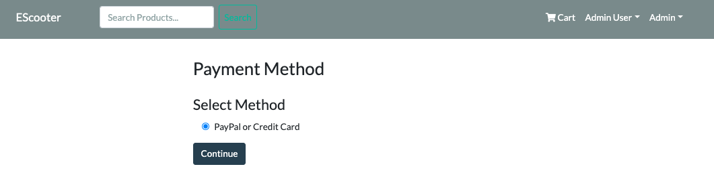

# ESCOOTER

## Descriptions
EScooter is a full stack CRUD application built with Mern Stack and React-redux as a front-end frameworks. This application contains the ability to allow customers to shop online for Electric Scooters.

## Home Page

## Shopping Cart

## SHipping

## PlaceOrder

## PlaceOrder confirm 

## Sign Up 

## Admin Users Page 

## Admin Products Page 

## Payment Method  

## Technologies

* Mern Stack
  * Mongo
  * Express
  * React
  * Node.js
  * Redux

* Create-react-app

## Features
* Include:
  * Login/ Register
  * Product search
  * View Products
  * Shopping Cart Functionality
  * Checkout process (shipping, payment method)
  * Administrative privileges include adding inventory
    * Update, Delete, and Add Inventory (through form or seed)
  *  Database seeder (products & users)

### Live Link

https://escooterapp.herokuapp.com/

* Git Hub 
  * https://github.com/sanaser58/escooterapp

#### Link to Wireframe

 * https://www.gomockingbird.com/projects/0gdxbdp/4gXVnC

 #### Documentation/Resources
 * https://reactjs.org/
 * https://redux.js.org/
 * https://redux.js.org/understanding/thinking-in-redux/glossary
 * https://react-bootstrap.github.io/
 * https://bootswatch.com/
 * https://chrome.google.com/webstore/detail/redux-devtools/lmhkpmbekcpmknklioeibfkpmmfibljd?hl=en
 * https://jwt.io/
 * https://create-react-app.dev/docs/deployment/
